# Desafio Modelando Um Dashboard De E-commerce

' Aqui adicionarei a resolução do desafio de Modelagem de Dados em um E-commerce. '

# Proposta do desafio solicitado pelo Bootcamp Engenharia de dados com Python.

### Descrição do Desafio de Projeto

Utilizaremos a tabela única de Financial Sample para criar as tabelas dimensão e fato do nosso modelo baseado em star schema.

O processo consiste na criação das tabelas com base na tabela original. A partir da cópia serão selecionadas as colunas que irão compor a visão da nova tabela. Sendo assim, a partir da tabela principal serão criadas as tabelas: 
Financials_origem (modo oculto – backup)

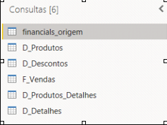

### Objetivos:

* D_Produtos (ID_produto, Produto, Média de Unidades Vendidas, Médias do valor de vendas, Mediana do valor de vendas, Valor máximo de Venda, Valor mínimo de Venda)

* D_Produtos_Detalhes(ID_produtos, Discount Band, Sale Price,  Units Sold, Manufactoring Price)

* D_Descontos (ID_produto, Discount, Discount Band)
* D_Detalhes (*)

* D_Calendário – Criada por DAX com calendar()

* F_Vendas (SK_ID , ID_Produto, Produto, Units Sold, Sales Price, Discount  Band, Segment, Country, Salers, Profit, Date (campos))

Verifique as informações que não foram contempladas nas demais tabelas dimensão que fornecem maiores detalhes sobre vendas.

Exemplo de tabela criada por agrupamento das informações
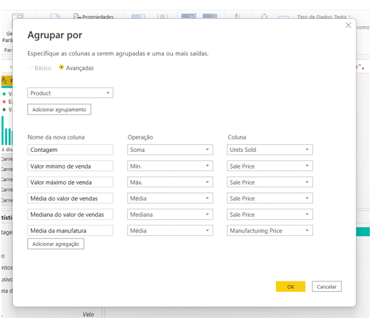

Exemplo de coluna sendo construida a partir de condicionais - Índices de produtos.
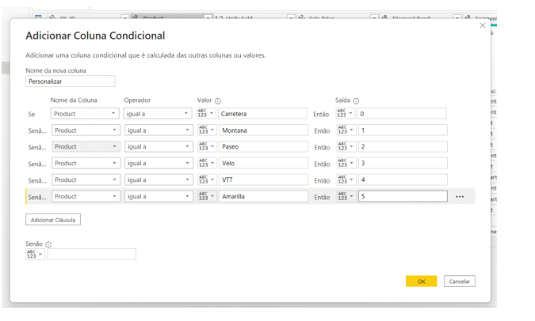

Reorganize as colunas:
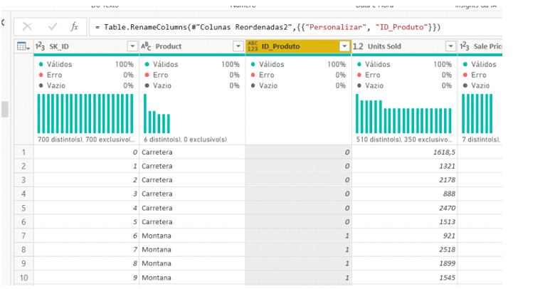

Exemplo de coluna sendo construída a partir de condicional – Índice de Produtos

Reorganize as colunas
 
Não se esqueça de salvar seu projeto para submeter ao Github. O link do seu repositório é utilizado na submissão do seu desafio de projeto. 

Você pode utilizar os seguintes pontos como base:
⦁	Salve o projeto .pbix
⦁	Salve uma imagem do seu esquema em estrela
⦁	Escreva no readme o processo de construção do seu diagrama
⦁	Fale sobre as etapas as funcionalidades e funções DAX utilizadas neste projeto

Utilize o repositório do Github como uma descrição do seu projeto para auxiliar outras pessoas e ser visto pelos recrutadores.

# Resolução 

### Um pouco sobre o processo:

- Como mencionado o objetivo do desafio era fazer a modelagem dos dados que ja estam arquitetados no mode de relacionamento. Com essa base fizemos o nosso tratamento para que podessemos transformar ele para uma estrutura estrela, tendo como objetivo de nossa arquitetura o F_vendas, e as dimensões D_produtos, D_produtos_detalhes, D_detalhes, D_descontos, D_date. Então nesse tratamento pegamos excluimos em cada dimensão oque não vamos usar, deixamos as tabelas que tem o foco como objetivo e por fim finalizamos com a exclusão de dados duplicados, fazendo assim a otimização e a limpreza de dados desnecessarios em nossa base de dados.

### Resolução da montagem da D_produtos:
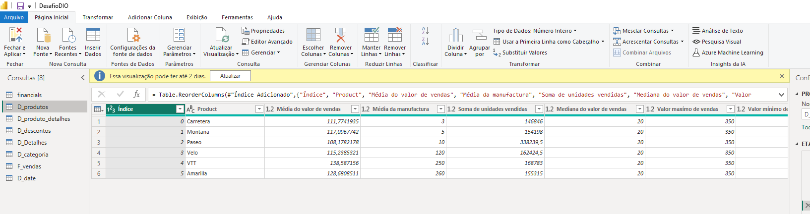
* D_Produtos (ID_produto, Produto, Média de Unidades Vendidas, Médias do valor de vendas, Mediana do valor de vendas, Valor máximo de Venda, Valor mínimo de Venda)

### Resoluçãoda montagem da D_produtos_detalhes:
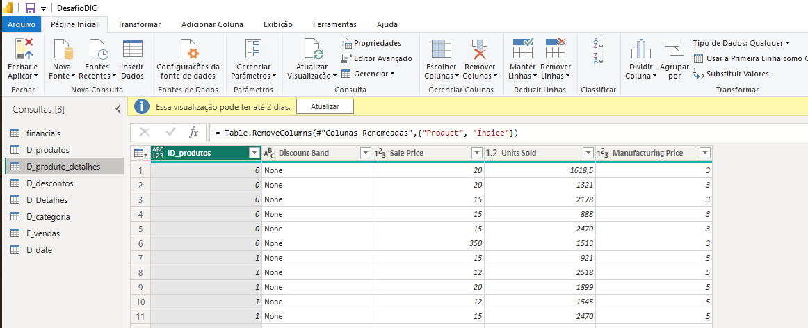
D_Produtos_Detalhes(ID_produtos, Discount Band, Sale Price,  Units Sold, Manufactoring Price)

### Resoluçãoda montagem da D_desconto:
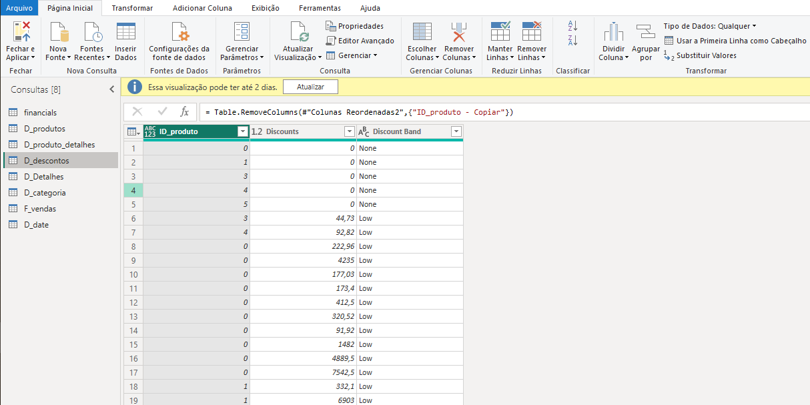
D_Descontos (ID_produto, Discount, Discount Band)

### Resoluçãoda montagem da D_detalhes:
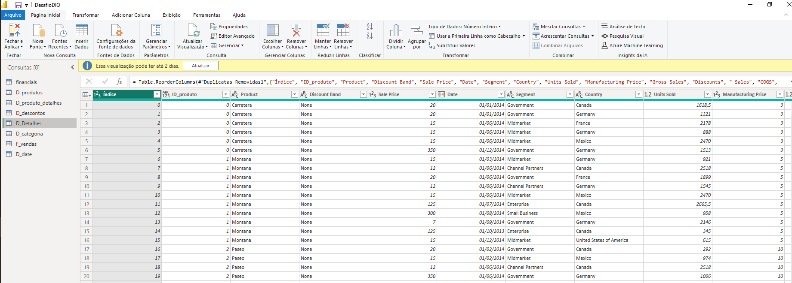
D_Detalhes (*)

### Resoluçãoda montagem da F_vendas:
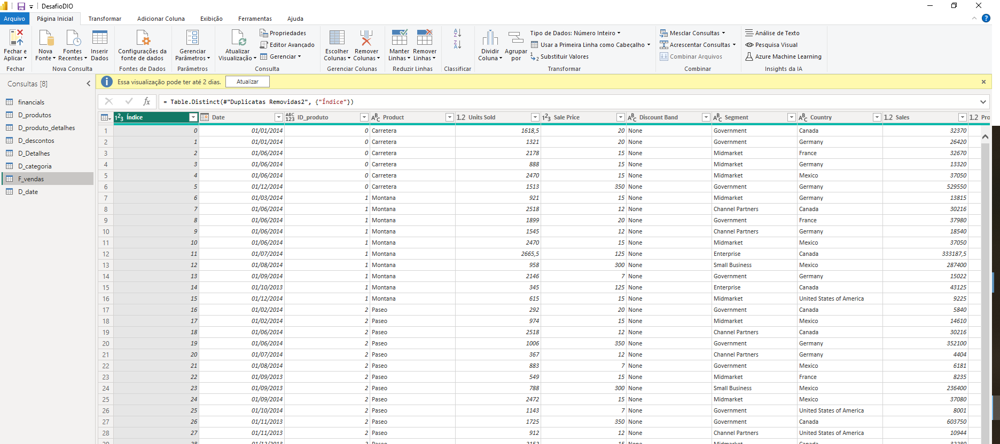
F_Vendas (SK_ID , ID_Produto, Produto, Units Sold, Sales Price, Discount  Band, Segment, Country, Salers, Profit, Date (campos))

### Resoluçãoda montagem da D_date:
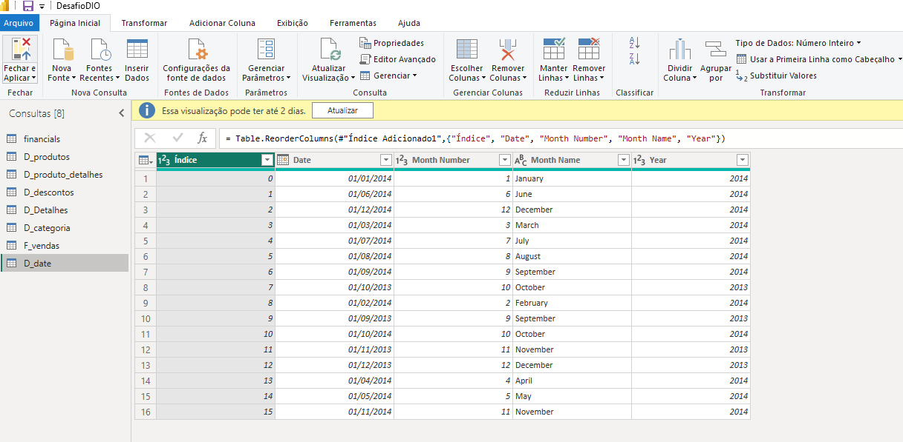
D_Calendário – Criada por DAX com calendar()

Salve uma imagem do seu esquema em estrela
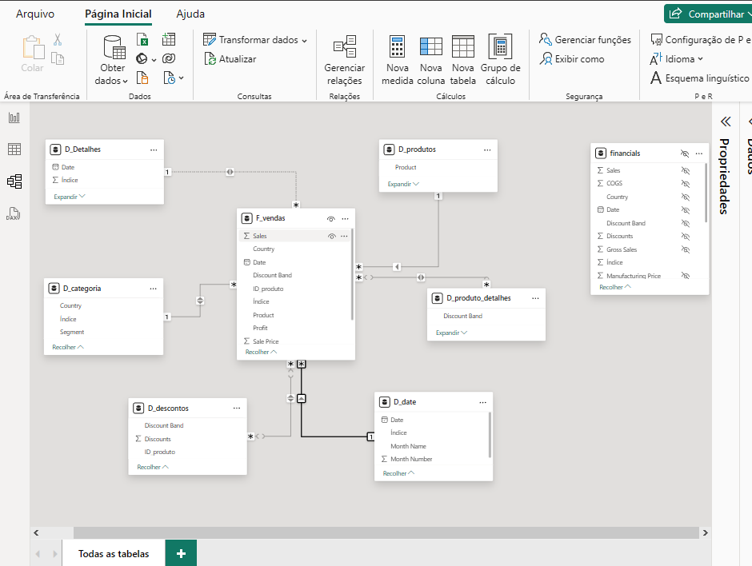
